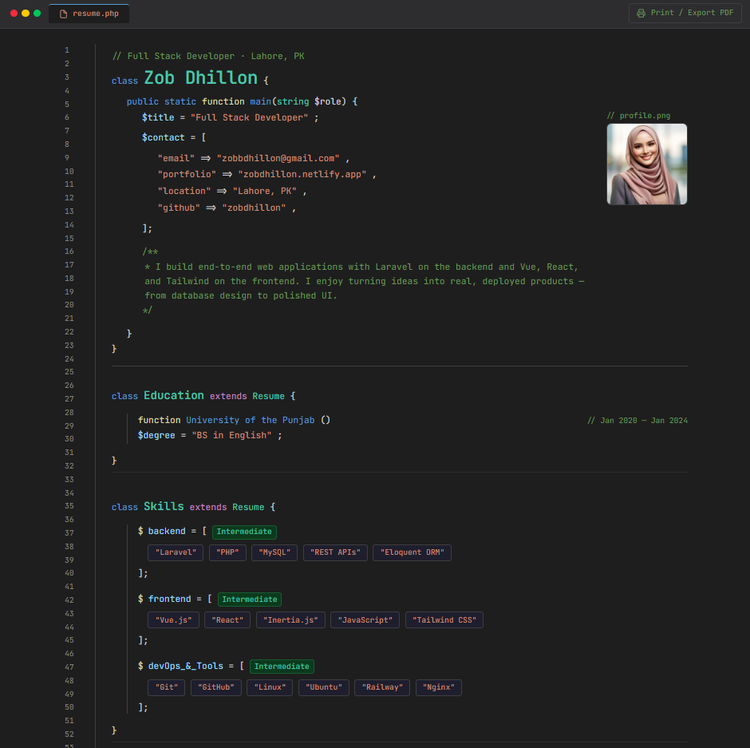

# `resume.php`

A single-page developer resume styled as a VS Code editor. Data lives in a `resume.json` file — the app reads it, hydrates it into typed PHP data objects, and renders it through Blade components with syntax highlighting, line numbers, and a tab bar.

**The resume is the project.**

[](https://your-live-url.up.railway.app)

---



---

## Stack

Laravel 11 · PHP 8.4 · Blade · Tailwind CSS v4 · JetBrains Mono

## How it works

```
resume.json → ResumeController → Resume::fromArray() → Blade Components → HTML
```

## Local Setup

```bash
composer install && npm install
cp .env.example .env && php artisan key:generate
npm run dev && php artisan serve
```

Edit `storage/resumes/resume.json` to update your resume data. Any empty section is automatically hidden.
